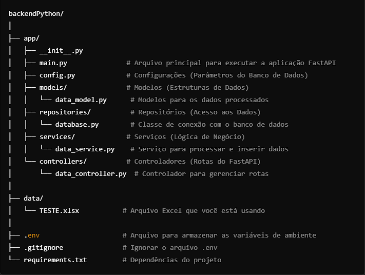

backend para exportar as APIS Python, tanto na questão de ETLs como para o uso das IAs

Visão Geral da Arquitetura
Configuração do Ambiente
Dependências
Instalação
Execução da aplicação
Configuração e Uso do Swagger
Como rodar o Swagger e documentar as rotas
Como Rodar os Testes
Documentação das Rotas da API
Instruções para integração da IA treinada

1. Visão Geral da Arquitetura
A stack proposta utiliza uma API construída com FastAPI para integrar uma IA treinada e realizar as seguintes operações:

Receber entradas via frontend: 
A API recebe as entradas de dados fornecidas pelo usuário para:
Realizar o cálculo de score (para algum tipo de análise preditiva).
Predizer a finalização de duplicatas (ou realizar alguma previsão baseada nos dados).
Processamento de dados via ETL: As transformações necessárias para preparar os dados antes de serem enviados à IA ocorrem através de scripts ETL integrados com a API.
A arquitetura base está dividida em:

Frontend: Interface que coleta os dados e envia para a API.
Backend (FastAPI): API que recebe os dados do frontend e encaminha para a IA treinada, além de realizar o processamento ETL.

IA Treinada: Um modelo de IA pré-treinado que faz previsões e devolve os resultados à API.

ETL: Scripts Python que executam transformações e limpeza dos dados antes de alimentar a IA.

2. Configuração do Ambiente

Dependências
A stack requer as seguintes dependências no projeto:

FastAPI: Para criar a API.

Uvicorn: Para rodar o servidor FastAPI.

pandas: Para manipulação e transformação de dados nas etapas ETL.

SQLAlchemy (se for necessário trabalhar com bancos de dados).

scikit-learn ou qualquer outra biblioteca de machine learning, dependendo do modelo IA utilizado.

Você pode instalar todas as dependências do projeto executando o seguinte comando no diretório raiz do projeto:

bash
Copy code
pip install fastapi uvicorn pandas scikit-learn
Se houver outras bibliotecas específicas para o modelo de IA, como tensorflow, pytorch, ou bibliotecas customizadas, elas também devem ser incluídas.

Instalação do projeto
No diretório do seu projeto, execute:

bash
Copy code
# Instalar todas as dependências
pip install -r requirements.txt

# Rodar as migrações do banco de dados (caso aplicável)
alembic upgrade head  # Alembic ou outra ferramenta para migração, caso haja um banco de dados
Execução da Aplicação

Para rodar o backend Python com FastAPI, execute o comando:

bash
Copy code
uvicorn app.main:app --reload
A API estará acessível em http://127.0.0.1:8000.

3. Configuração e Uso do Swagger
O FastAPI inclui automaticamente uma interface Swagger para a documentação das rotas da API. Para acessar o Swagger e utilizar como documentação:

Acesse a interface de documentação do Swagger após iniciar o servidor:
Swagger UI: http://127.0.0.1:8000/docs
Documentação em formato OpenAPI: http://127.0.0.1:8000/openapi.json

O Swagger já estará configurado para documentar todas as rotas criadas na API. Para incluir descrições mais detalhadas para as rotas, você pode usar as anotações da própria FastAPI:

python
Copy code
from fastapi import FastAPI
from pydantic import BaseModel

app = FastAPI()

class Item(BaseModel):
    name: str
    description: str

@app.post("/items/", summary="Cria um novo item", description="Rota para criar um item na base de dados.")
async def create_item(item: Item):
    return {"name": item.name, "description": item.description}
O Swagger automaticamente mostrará a descrição da rota, seu nome, e o corpo esperado da requisição.

Adicionando dependências
As dependências para o projeto são adicionadas no arquivo requirements.txt. Para incluir uma nova dependência, siga este formato:

bash
Copy code
# No terminal
pip install <nova_dependencia>
pip freeze > requirements.txt  # Atualizar o arquivo requirements.txt
4. Como Rodar os Testes
Utilizando pytest, você pode rodar todos os testes do projeto com o seguinte comando:

bash
Copy code
pytest
Certifique-se de que suas configurações de teste estão corretas e que você configurou corretamente o __init__.py no diretório de testes, conforme mencionado anteriormente.

5. Documentação das Rotas da API
A API terá as seguintes rotas principais:

/score (POST)

Descrição: Recebe os dados do frontend e retorna o cálculo de score.
Exemplo de requisição:
json
Copy code
{
    "cnpj": "123456789",
    "faturamento": 100000,
    "historico": {...}
}
Exemplo de resposta:
json
Copy code
{
    "score": 780
}
/predicao (POST)

Descrição: Faz a previsão sobre a finalização de duplicatas.
Exemplo de requisição:
json
Copy code
{
    "id_duplicata": "456",
    "valor": 15000,
    "prazo": "2023-12-31"
}
Exemplo de resposta:
json
Copy code
{
    "predicao": "finalizada"
}
/docs (GET)

Descrição: Acessa a documentação Swagger.
URL: http://127.0.0.1:8000/docs
/openapi.json (GET)

Descrição: Acessa a especificação OpenAPI.
URL: http://127.0.0.1:8000/openapi.json
6. Instruções para Integração da IA Treinada
Para integrar a IA treinada no projeto, você precisa seguir os seguintes passos:

Salvar o modelo treinado: Utilize a biblioteca que você está utilizando (como scikit-learn, tensorflow, etc.) para salvar o modelo treinado.

Exemplo com scikit-learn:
python
Copy code
import pickle

with open("model.pkl", "wb") as f:
    pickle.dump(trained_model, f)
Carregar o modelo no backend: No seu serviço de FastAPI, adicione o código para carregar o modelo treinado e fazer previsões.

Exemplo:
python
Copy code
import pickle
from fastapi import FastAPI
from pydantic import BaseModel

app = FastAPI()

# Carregar modelo treinado
with open("model.pkl", "rb") as f:
    model = pickle.load(f)

class InputData(BaseModel):
    feature1: float
    feature2: float

@app.post("/score")
async def predict_score(data: InputData):
    prediction = model.predict([[data.feature1, data.feature2]])
    return {"score": prediction[0]}
Receber entradas e fazer previsões: A API receberá as entradas, passará pelos ETLs (se necessário), e retornará o resultado gerado pelo modelo de IA treinado.

Resumo
Instalação: Siga os passos descritos para instalar as dependências e rodar a aplicação.
Swagger: Use http://127.0.0.1:8000/docs para acessar a documentação das rotas via Swagger.
Integração da IA: Adicione o código necessário para carregar seu modelo treinado e fazer previsões com as entradas recebidas.
ETLs e Testes: Utilize os testes configurados com pytest e scripts ETL para transformar os dados antes de alimentar a IA.
Este guia deve permitir que os desenvolvedores entendam como configurar e utilizar a stack proposta, incluindo o uso do Swagger para documentação das APIs e integração da IA treinada.